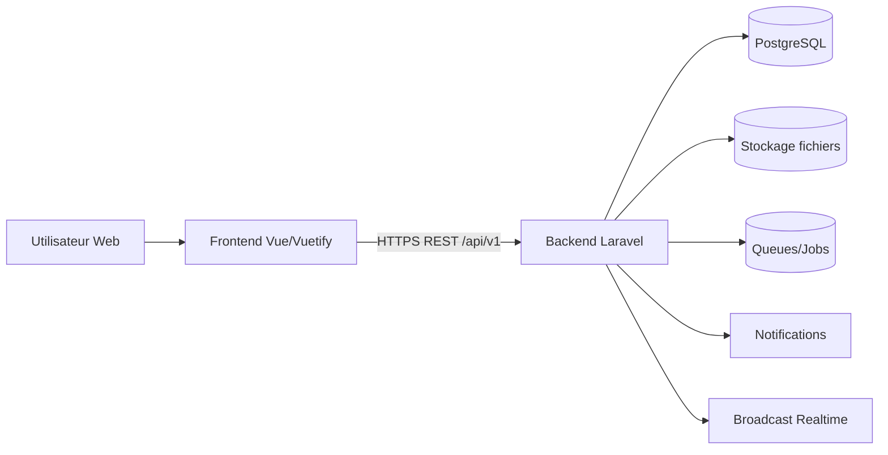
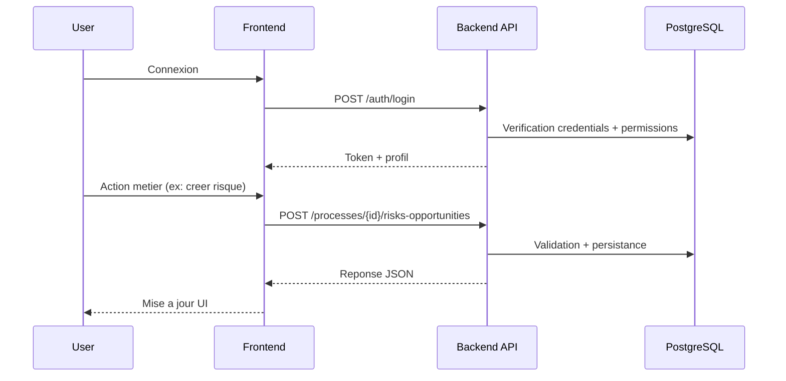
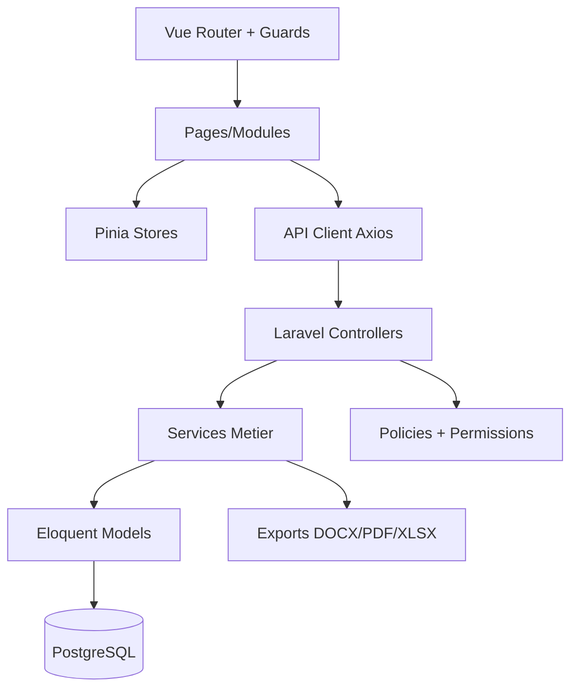

# Documentation Technique Complete - BestQHSE

Date: 25 mars 2026
Perimetre: application complete (frontend `frontend/` + backend `backend/`)

## 1. Presentation generale du projet

BestQHSE est une plateforme SaaS de management QHSE/SMI (Qualite, Securite, Environnement, Energie) pour des organisations multi-entreprises et multi-sites.

La plateforme couvre notamment:

- gestion de contexte et parties interessees,
- pilotage des processus,
- risques et opportunites,
- objectifs, indicateurs, actions,
- audits et non-conformites,
- gestion documentaire (workflow, signatures, versions),
- modules support (equipements, maintenance, formations, competences),
- administration superadmin (offres, abonnements, normes, entreprises).

## 2. Objectifs du projet

- Digitaliser le systeme de management QHSE.
- Standardiser les workflows ISO (planifier, executer, verifier, ameliorer).
- Tracer les actions et decisions (audit trail).
- Garantir la securite d'acces (roles/permissions, MFA, controle d'abonnement).
- Offrir une base evolutive pour l'ajout de nouveaux modules metier.

## 3. Technologies utilisees

### 3.1 Backend

- PHP 8.2+
- Laravel 12
- Laravel Sanctum (auth API)
- Spatie Permission + Spatie Activitylog
- Laravel Horizon / Queue
- Laravel Reverb (realtime, selon configuration)
- PhpSpreadsheet / PHPWord / DomPDF (exports XLSX/DOCX/PDF)
- PostgreSQL (par defaut)
- Redis/Predis (cache/queue/realtime selon environnement)

### 3.2 Frontend

- Vue 3 + TypeScript
- Vite 7
- Vuetify 3
- Pinia (state management)
- Vue Router 4
- Axios
- Chart libs: ApexCharts, ECharts, Chart.js
- XLSX (export Excel)

## 4. Architecture globale du systeme



### 4.1 Segmentation fonctionnelle

- `super_admin`: gouvernance plateforme (offres, normes, entreprises, settings).
- `company`: exploitation metier SMI par entreprise/site.
- `clientb`: usage client final cible.

### 4.2 Securite transversale (backend)

Middlewares API principaux:

- `auth:sanctum`
- `force.password`, `force.signature`, `force.company`
- `check.subscription`, `ensure.ownership`
- `mfa.stepup`
- `security.audit`, `ip.blocking`, `throttle`

## 5. Structure des dossiers

## 5.1 Backend (`backend/`)

- `app/Http/Controllers/Api`: endpoints REST
- `app/Http/Requests`: validation
- `app/Models`: modeles Eloquent
- `app/Services`: logique metier
- `app/Policies`: autorisations fines
- `app/Http/Middleware`: securite et gouvernance d'acces
- `database/migrations`: schema DB evolutif
- `routes/api.php`: routes versionnees `/api/v1`
- `storage/logs`: logs applicatifs

## 5.2 Frontend (`frontend/src/`)

- `modules/`: segmentation par espaces (clienta, clientb, superadmin, company)
- `pages/`: vues applicatives
- `components/`: composants UI metier
- `stores/`: stores Pinia
- `router/`: routes modulaires + guards
- `api/`: client HTTP et services API
- `styles/`: tokens + styles globaux

## 6. Modules et composants principaux

- Authentification et profil
- Dashboard/KPIs
- Contexte & parties interessees
- Processus, cartographie, versions
- Risques/opportunites
- Objectifs/indicateurs/actions
- Audits/programmes d'audit
- Non-conformites/reclamations
- GED documents/workflows/signatures
- Support (equipements, maintenance, formation, competences)
- Superadmin (offres, normes, abonnements, users, entreprises)

## 7. API et endpoints (vue d'ensemble)

Base URL (dev frontend): `http://localhost:8000/api/v1`

### 7.1 Auth

- `POST /auth/login`
- `POST /auth/register/enterprise`
- `POST /auth/register/client`
- `POST /auth/mfa/verify`
- `GET /auth/me` (auth)
- `POST /auth/logout` (auth)

### 7.2 Coeur metier

- `GET/POST/PUT/DELETE /processes`
- `GET/POST/PUT/DELETE /risks-opportunities`
- `GET/POST/PUT/DELETE /risks`
- `GET/POST/PUT/DELETE /opportunities`
- `GET/POST/PUT/DELETE /actions`
- `GET/POST/PUT/DELETE /audits`
- `GET/POST/PUT/DELETE /non-conformities`
- `GET/POST/PUT/DELETE /documents`

### 7.3 Exemples d'appels API

```bash
curl -X POST http://localhost:8000/api/v1/auth/login \
  -H "Content-Type: application/json" \
  -d '{"email":"admin@BestQHSE.com","password":"******"}'
```

```bash
curl http://localhost:8000/api/v1/risks-opportunities \
  -H "Authorization: Bearer <TOKEN>"
```

## 8. Authentification et securite

- Auth API via Sanctum.
- Expiration de session/tokens configuree a 8h max (`SANCTUM_EXPIRATION` borne a 480 min).
- MFA pour actions sensibles superadmin (`mfa.stepup`).
- ACL via Spatie (roles + permissions).
- Controle de perimetre entreprise/site via middleware d'ownership.
- Limitation de debit sur login/search/API/export/upload.

## 9. Base de donnees

Le schema est modulaire et etendu (migrations Laravel). Relations principales:

- `enterprises` 1-N `sites`
- `sites` 1-N `processes`
- `processes` 1-N `process_risk_opportunities`
- `processes` 1-N `objectives`
- `risks/opportunities` 1-N actions planifiees (JSON `planned_actions` selon contexte)
- `users` N-N `roles`/`permissions`
- `documents` 1-N `document_versions`, `document_approvals`
- `audits` 1-N `audit_findings`

## 10. Flux de fonctionnement applicatif



## 11. Installation du projet

### 11.1 Prerequis

- PHP 8.2+
- Composer
- Node.js 20+
- npm
- PostgreSQL 14+
- (Optionnel) Redis

### 11.2 Backend

```bash
cd backend
composer install
cp .env.example .env
php artisan key:generate
# Configurer DB dans .env
php artisan migrate
php artisan db:seed
php artisan serve
```

### 11.3 Frontend

```bash
cd frontend
npm install
cp .env.development .env.local
npm run dev
```

## 12. Configuration d'environnement

### 12.1 Backend (`backend/.env`)

Variables critiques:

- `APP_URL`
- `DB_*`
- `SANCTUM_STATEFUL_DOMAINS`
- `SANCTUM_EXPIRATION` (max 480)
- `QUEUE_CONNECTION`
- `MAIL_*`
- `GROK_API_KEY` (si IA active)

### 12.2 Frontend (`frontend/.env.*`)

- `VITE_API_BASE_URL` (doit inclure `/api/v1`)
- `VITE_APP_NAME`
- `VITE_ENABLE_*`

## 13. Lancement local

- Backend: `php artisan serve`
- Frontend: `npm run dev`
- Build frontend: `npm run build`
- Tests backend: `composer test` ou `composer test:backend`
- Tests frontend: `npm run test`

## 14. Deploiement (CI/CD)

Aucun pipeline unique CI/CD n'est impose dans ce depot, mais le processus recommande:

1. Build frontend (`npm run build`).
2. Tests backend/frontend.
3. Migrations DB (`php artisan migrate --force`).
4. Cache Laravel (`config:cache`, `route:cache`) en prod.
5. Workers queue/Horizon actifs.

## 15. Bonnes pratiques de contribution

- Branches feature courtes et ciblees.
- Validation locale avant merge (tests + build).
- Migrations retrocompatibles et idempotentes.
- Respect du versioning API `/api/v1`.
- Ne jamais casser les controles d'acces (middleware + permissions).
- Documenter les nouveaux endpoints et impacts fonctionnels.

## 16. Gestion des erreurs et logs

- Logs Laravel: `backend/storage/logs/laravel.log`.
- Reponses API standardisees (401/403/422/500).
- Journaux d'activite via Spatie Activitylog.
- Audit securite via middleware dedie.
- En production hors local: messages 500 generiques cote client, details dans logs.

## 17. Diagramme de composants (resume)



## 18. Notes importantes pour nouveaux developpeurs

- Le projet est riche fonctionnellement: commencer par un module (ex. risques/opportunites) avant d'elargir.
- Le controle d'acces est central: toujours verifier `middleware + permissions + ownership`.
- L'application est multi-site/multi-entreprise: ne jamais coder en supposant un tenant unique.
- Avant refactor API, verifier les routes legacy/depreciees encore consommees par le frontend.
